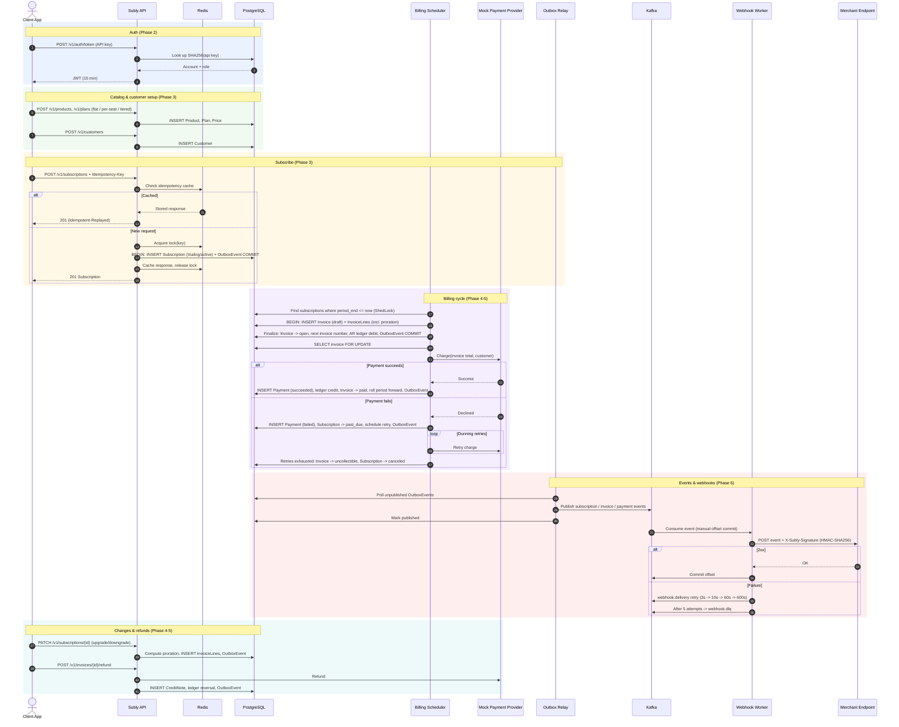
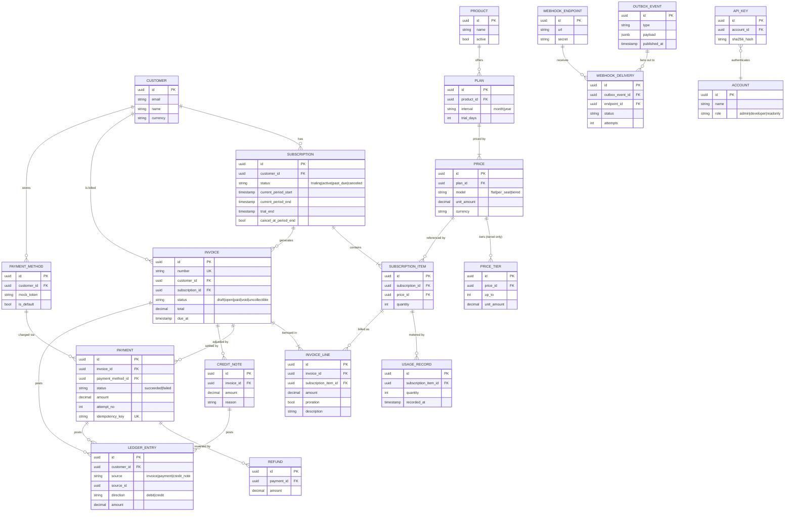

# Diagrams

GitHub renders the Mermaid below natively. Sources: `sequence.mmd`, `er.mmd`.

## End-to-end flow

```mermaid
sequenceDiagram
    autonumber
    actor Client as Client App
    participant API as Subly API
    participant Redis
    participant DB as PostgreSQL
    participant Sched as Billing Scheduler
    participant Pay as Mock Payment Provider
    participant Outbox as Outbox Relay
    participant Kafka
    participant WH as Webhook Worker
    participant Ext as Merchant Endpoint

    rect rgb(235,242,255)
    Note over Client,DB: Auth (Phase 2)
    Client->>API: POST /v1/auth/token (API key)
    API->>DB: Look up SHA256(api key)
    DB-->>API: Account + role
    API-->>Client: JWT (15 min)
    end

    rect rgb(240,250,240)
    Note over Client,DB: Catalog & customer setup (Phase 3)
    Client->>API: POST /v1/products, /v1/plans (flat / per-seat / tiered)
    API->>DB: INSERT Product, Plan, Price
    Client->>API: POST /v1/customers
    API->>DB: INSERT Customer
    end

    rect rgb(255,248,230)
    Note over Client,Outbox: Subscribe (Phase 3)
    Client->>API: POST /v1/subscriptions + Idempotency-Key
    API->>Redis: Check idempotency cache
    alt Cached
        Redis-->>API: Stored response
        API-->>Client: 201 (Idempotent-Replayed)
    else New request
        API->>Redis: Acquire lock(key)
        API->>DB: BEGIN: INSERT Subscription (trialing/active) + OutboxEvent COMMIT
        API->>Redis: Cache response, release lock
        API-->>Client: 201 Subscription
    end
    end

    rect rgb(245,238,255)
    Note over Sched,Pay: Billing cycle (Phase 4-5)
    Sched->>DB: Find subscriptions where period_end <= now (ShedLock)
    Sched->>DB: BEGIN: INSERT Invoice (draft) + InvoiceLines (incl. proration)
    Sched->>DB: Finalize: Invoice -> open, next invoice number, AR ledger debit, OutboxEvent COMMIT
    Sched->>DB: SELECT invoice FOR UPDATE
    Sched->>Pay: Charge(invoice total, customer)
    alt Payment succeeds
        Pay-->>Sched: Success
        Sched->>DB: INSERT Payment (succeeded), ledger credit, Invoice -> paid, roll period forward, OutboxEvent
    else Payment fails
        Pay-->>Sched: Declined
        Sched->>DB: INSERT Payment (failed), Subscription -> past_due, schedule retry, OutboxEvent
        loop Dunning retries
            Sched->>Pay: Retry charge
        end
        Sched->>DB: Retries exhausted: Invoice -> uncollectible, Subscription -> canceled
    end
    end

    rect rgb(255,238,238)
    Note over Outbox,Ext: Events & webhooks (Phase 6)
    Outbox->>DB: Poll unpublished OutboxEvents
    Outbox->>Kafka: Publish subscription / invoice / payment events
    Outbox->>DB: Mark published
    Kafka->>WH: Consume event (manual offset commit)
    WH->>Ext: POST event + X-Subly-Signature (HMAC-SHA256)
    alt 2xx
        Ext-->>WH: OK
        WH->>Kafka: Commit offset
    else Failure
        WH->>Kafka: webhook.delivery retry (3s -> 10s -> 60s -> 600s)
        WH->>Kafka: After 5 attempts -> webhook.dlq
    end
    end

    rect rgb(238,250,250)
    Note over Client,DB: Changes & refunds (Phase 4-5)
    Client->>API: PATCH /v1/subscriptions/{id} (upgrade/downgrade)
    API->>DB: Compute proration, INSERT InvoiceLines, OutboxEvent
    Client->>API: POST /v1/invoices/{id}/refund
    API->>Pay: Refund
    API->>DB: INSERT CreditNote, ledger reversal, OutboxEvent
    end
```

## Entities

```mermaid
erDiagram
    CUSTOMER ||--o{ SUBSCRIPTION : "has"
    CUSTOMER ||--o{ INVOICE : "is billed"
    CUSTOMER ||--o{ PAYMENT_METHOD : "stores"
    PRODUCT ||--o{ PLAN : "offers"
    PLAN ||--|{ PRICE : "priced by"
    PRICE ||--o{ PRICE_TIER : "tiers (tiered only)"
    SUBSCRIPTION ||--|{ SUBSCRIPTION_ITEM : "contains"
    PRICE ||--o{ SUBSCRIPTION_ITEM : "referenced by"
    SUBSCRIPTION_ITEM ||--o{ USAGE_RECORD : "metered by"
    SUBSCRIPTION ||--o{ INVOICE : "generates"
    INVOICE ||--|{ INVOICE_LINE : "itemised in"
    SUBSCRIPTION_ITEM ||--o{ INVOICE_LINE : "billed as"
    INVOICE ||--o{ PAYMENT : "settled by"
    PAYMENT_METHOD ||--o{ PAYMENT : "charged via"
    INVOICE ||--o{ CREDIT_NOTE : "adjusted by"
    PAYMENT ||--o{ REFUND : "reversed by"
    INVOICE ||--o{ LEDGER_ENTRY : "posts"
    PAYMENT ||--o{ LEDGER_ENTRY : "posts"
    CREDIT_NOTE ||--o{ LEDGER_ENTRY : "posts"
    OUTBOX_EVENT ||--o{ WEBHOOK_DELIVERY : "fans out to"
    WEBHOOK_ENDPOINT ||--o{ WEBHOOK_DELIVERY : "receives"
    API_KEY }o--|| ACCOUNT : "authenticates"

    CUSTOMER { uuid id PK
      string email
      string name
      string currency }
    PRODUCT { uuid id PK
      string name
      bool active }
    PLAN { uuid id PK
      uuid product_id FK
      string interval "month|year"
      int trial_days }
    PRICE { uuid id PK
      uuid plan_id FK
      string model "flat|per_seat|tiered"
      decimal unit_amount
      string currency }
    PRICE_TIER { uuid id PK
      uuid price_id FK
      int up_to
      decimal unit_amount }
    SUBSCRIPTION { uuid id PK
      uuid customer_id FK
      string status "trialing|active|past_due|canceled"
      timestamp current_period_start
      timestamp current_period_end
      timestamp trial_end
      bool cancel_at_period_end }
    SUBSCRIPTION_ITEM { uuid id PK
      uuid subscription_id FK
      uuid price_id FK
      int quantity }
    USAGE_RECORD { uuid id PK
      uuid subscription_item_id FK
      int quantity
      timestamp recorded_at }
    INVOICE { uuid id PK
      string number UK
      uuid customer_id FK
      uuid subscription_id FK
      string status "draft|open|paid|void|uncollectible"
      decimal total
      timestamp due_at }
    INVOICE_LINE { uuid id PK
      uuid invoice_id FK
      uuid subscription_item_id FK
      decimal amount
      bool proration
      string description }
    PAYMENT_METHOD { uuid id PK
      uuid customer_id FK
      string mock_token
      bool is_default }
    PAYMENT { uuid id PK
      uuid invoice_id FK
      uuid payment_method_id FK
      string status "succeeded|failed"
      decimal amount
      int attempt_no
      string idempotency_key UK }
    REFUND { uuid id PK
      uuid payment_id FK
      decimal amount }
    CREDIT_NOTE { uuid id PK
      uuid invoice_id FK
      decimal amount
      string reason }
    LEDGER_ENTRY { uuid id PK
      uuid customer_id FK
      string source "invoice|payment|credit_note"
      uuid source_id
      string direction "debit|credit"
      decimal amount }
    OUTBOX_EVENT { uuid id PK
      string type
      jsonb payload
      timestamp published_at }
    WEBHOOK_ENDPOINT { uuid id PK
      string url
      string secret }
    WEBHOOK_DELIVERY { uuid id PK
      uuid outbox_event_id FK
      uuid endpoint_id FK
      string status
      int attempts }
    ACCOUNT { uuid id PK
      string name
      string role "admin|developer|readonly" }
    API_KEY { uuid id PK
      uuid account_id FK
      string sha256_hash }
```
